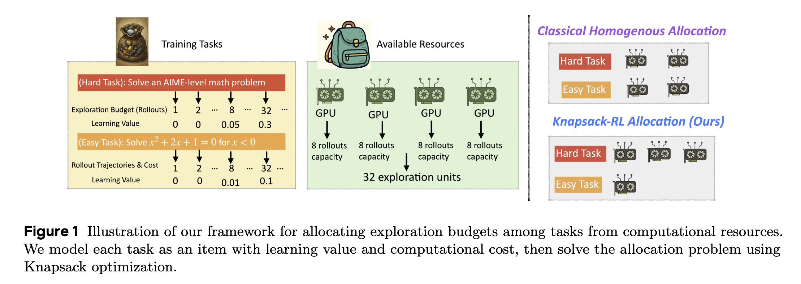
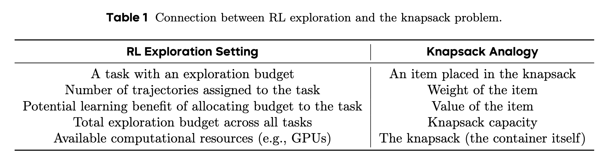

# Knapsack RL


## Introduction

The implementation of [Knapsack RL: Unlocking Exploration of LLMs via Optimizing Budget Allocation](https://arxiv.org/pdf/2509.25849).

Knapsack RL is a new approach for allocating exploration budgets in Reinforcement Learning (RL) with Large Language Models (LLMs). By formulating the problem as a classical knapsack optimization over tasks’ values and costs, Knapsack RL enables dynamic, compute-efficient exploration, leading to more effective discoveries of high-quality trajectories—especially on hard tasks.





Click to view the abstract.
<details> 
Large Language Models (LLMs) can self-improve through reinforcement learning, where they
generate trajectories to explore and discover better solutions. However, this exploration process is
computationally expensive, often forcing current methods to assign limited exploration budgets to
each task. This uniform allocation creates problematic edge cases: easy tasks consistently succeed
while difficult tasks consistently fail, both producing zero gradients during training updates for
the widely used Group Relative Policy Optimization (GRPO). We address this problem from the
lens of exploration budget allocation. Viewing each task’s exploration as an "item" with a distinct
"value" and "cost", we establish a connection to the classical knapsack problem. This formulation
allows us to derive an optimal assignment rule that adaptively distributes resources based on the
model’s current learning status. When applied to GRPO, our method increases the effective ratio
of non-zero policy gradients by 20-40% during training. Acting as a computational "free lunch",
our approach could reallocate exploration budgets from tasks where learning is saturated to those
where it is most impactful. This enables significantly larger budgets (e.g., 93 rollouts) for especially
challenging problems, which would be computationally prohibitive under a uniform allocation.
These improvements translate to meaningful gains on mathematical reasoning benchmarks, with
average improvements of 2-4 points and peak gains of 9 points on specific tasks. Notably, achieving
comparable performance with traditional homogeneous allocation would require about 2x the
computational resources.
</detail>


## Features

- **Adaptive Exploration Budget Allocation:** Dynamically reallocates compute across tasks.
- **GRPO-based Optimization:** Seamless integration with Group Relative Policy Optimization, with no introduction of additional algorithmic bias.

- **Easy intergration:** Core parts of training and inference remain untouched, ensuring easy compatibility with existing training infrastructure.


## Installation

Requirements:

- Verl (version 0.5)
- All packages in `requirements.txt`

To install dependencies:
```bash
pip install -r requirements.txt
```

## Quick Start

Our core change introduces an adaptive, knapsack-based scheduler that allocates rollout counts across prompts. The integration point is `verl/trainer/ppo/ray_trainer.py`, and the optimization logic resides in `verl/trainer/ppo/exploration_utils.py`.

1. **Clone the repo:**
   ```bash
   git clone https://github.com/your_username/KnapsackRL.git
   cd KnapsackRL
   ```
2. **Set environment variables:**  
   Before running scripts, set:
   ```bash
   export RAY_DATA_HOME=/path/to/data
   export RAY_SAVE_HOME=/path/to/results
   export RAY_MODEL_HOME=/path/to/models
   export NNODES=1
   ```

3. **Run training scripts:**  
   Example scripts are provided in `examples/knapsack_trainer/`.  
   For standard GRPO:
   ```bash
   bash examples/knapsack_trainer/run_grpo_7b.sh
   ```
   For Knapsack RL (adaptive allocation):
   ```bash
   bash examples/knapsack_trainer/run_knapsack_grpo_7b.sh
   ```

## Usage Example Scripts

- `run_grpo_7b.sh`: Baseline GRPO training (no adaptive allocation)
- `run_knapsack_grpo_7b.sh`: Knapsack RL with adaptive budget allocation

For details, see comments and variable settings at the top of each script.

## Acknowledgements

Our work is built upon the [Verl](https://github.com/volcengine/verl) framework for training. We also acknowledge the use of [rllm](https://github.com/rllm-org/rllm) for its reward evaluation function and related datasets.


## Citation

If you find our work useful, please cite as:
```bibtext
@article{li2025knapsack,
  title={Knapsack rl: Unlocking exploration of llms via optimizing budget allocation},
  author={Li, Ziniu and Chen, Congliang and Yang, Tianyun and Ding, Tian and Sun, Ruoyu and Zhang, Ge and Huang, Wenhao and Luo, Zhi-Quan},
  journal={arXiv preprint arXiv:2509.25849},
  year={2025}
}
```